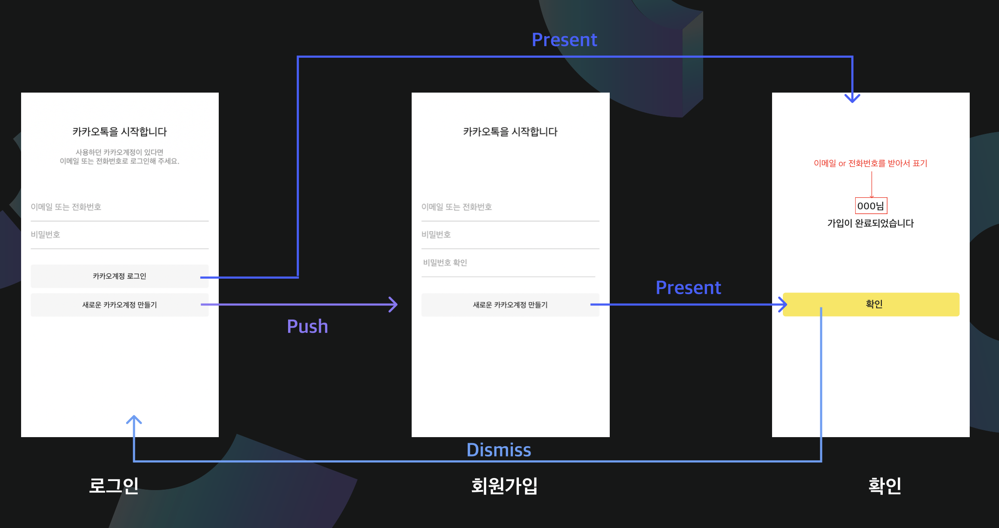
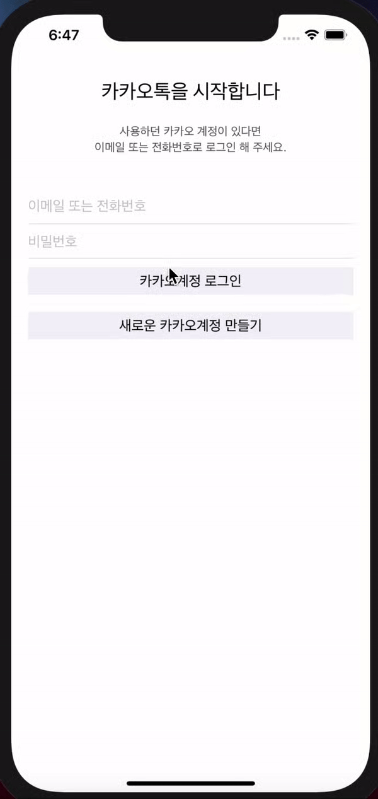

# 1주차 과제

1주차에는 iOS기초와 페이지 이동을 배웠다.

이번엔 StoryBoard를 이용해서 카카오톡 클론코딩을 진행한다고 하셨당.
그래서 이번과제는 오늘 배운 페이지 이동을 이용해서 로그인 화면에서, 회원가입또는 로그인 화면으로 넘어가는 프로그램을 구현하기 이다. 

Present & Dismiss와 Push&Pop 이 두가지 방식을 모두 이용해서 구현해야 한다. 

|present 구현|
|-----------|
    self.present(nextCA, animated: true, completion: nil)

|push 구현|
|--------|
    self.navigationController?.pushViewController(nextNA, animated: true)

근데 push와 present로 구현할 수 있었지만,,, textfield안에 값이 있냐 없냐도 판단해서 push와 present를 할지 말지도 정해주어야 했다. 

그래서! 그냥 If문을 사용해서 textField안에 값이 전부다 차있어야 (not nil일때) present와 push가 실행되도록 했으나,,,,,,,
사실,,, textFieldd안에 아무것도 없는 상태는 nil이 아니라 "" 였다.
(모르면 항상 print()로 찍어봅시다,,,,)

|조건구현|
|------|
    if EmailPhoneNumber.text != "" && PassWord.text != ""

이것뿐만아니라, 회원가입이 완료된 이후에는 3번째 뷰컨에서 처음으로 넘어가야 했다. 
이것도 처음에 감 못잡고 해메고 있었는데,,,
LifeCycle을 생각해보라는 !!!! 한 OB분의 도움을 받아!!! 그냥 3번째화면으로 present하면서 바로 2번째 화면을 pop해버리는 방법을 선택했다... 사실 될줄몰랐는데 되서 놀랬다.

아 그리고 이건 조건은 아닌데! 두개 다 입력을 안했을경우와 비밀번호와 비밀번호 확인이 다를때, 라벨에 경고문구를 띄웠당,, 뭔가 있어보이잖아여,,,

|구현|
|------|
     if PassWordInput.text == PasswordCorrect.text{}
그렇게,,, 1주차 과제가 끝났다. 
사실 2주차가 되서야 1주차 리드미를 쓰는관계로,,, 구현영상이 없다,,, 그래도 약간 맛보기 느낌으로,, 하나 올려보려한다.,,,,

