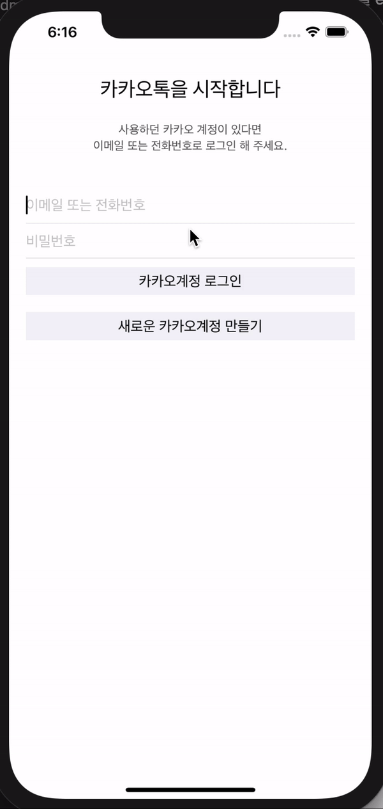

# 2주차 과제

2주차에는 레이아웃을 다른기기마다 동일하게 적용시키는 법을 배웠고, 여러가지 뷰에 대해서 배웟다. 

이번주차 과제는 저번에 만들었던, 회원가입과 로그인 뷰에 대해서 모든 기기에 동일하게 보일 수 있게 구현하는 것이었다!

두번의 고비중 첫번째 고비가 왔던것은, 탭바 컨트롤러를 구현하는 것 이었는데, 뷰컨을 이용해서 탭바로 넘기는 것을 구현하려고 하는것 자체가 문제였단걸 깨닳았다. 

탭바는 탭바 컨트롤을 이용해서 해주는건데,,,,하하,, 팟장님 감사합니다.,,,,

|layout 구현|
|-----------|
    레이아웃들의 경우에는 constraints를 이용해서 safearea로 부터 일정 거리를 유지할 수 있도록 구현해줬고, stackView와 imageView를 이용해 과제에서 말하는 대로 구현했다. 

여기까진 괜찮았지만, 도전과제를 해보겠다고 당차게 구현을 시작한 이후부터 두번째 고비가 찾아왔다. 
어떻게 해야할지 감 조차 안 와서 구선생님(google)의 도움을 받았더니, panGesture을 이용해서 구현하면 된다구 했다. 
근데,,,, panGesture을 이용해서 이미지뷰를 이리저리 움직이는건 가능했는데, UIView에 적용해보니까 아예 안되는 것이었다..... 

결국,,,, 다시 구선생님의 도움을 받아서,, 구현에는 성공했는데,, 문제는 화면을 위로 올릴때도 화면이 움직인다는 것이었다. 
그래서 Velocity의 y축값이 음으로 가게되면 화면의 상태를 정지상태로 다시 돌려놓는 방법으로 어찌어찌,,, 구현해보았다. 

|도전과제 구현|
|-----------|
    view.addGestureRecognizer(panGestureRecognizer!)
이게 viewDidLoad에서 화면에 제스처가 들어올경우 팬제스처로 넘겨주는 그런느낌?

     if velocity_s.y < 0{
                panGesture.state = .ended
                UIView.animate(withDuration: 0, animations: {self.view.center = self.originalPosition!})
            }
정보) velocity.x는 우리가 일반적으로 생각하는 것 처럼 왼쪽으로 가면 음수고, 오른쪽으로 가면 양수이지만
velocity.y는 위로 이동하면 음수고, 아래로 이동하면 양수이다.
그래서 화면이 위로 올라가게 되면 상태를 end로 바꿔줘서 못올라가게 해버렷당 근데도 자꾸 움찔움찔한다 ㅠ 더 공부해서 이건 방법을 찾아봐야겟다

     if velocity.y >= 1500{
                UIView.animate(withDuration: 0.2, animations: {self.view.frame.origin = CGPoint(x: self.view.frame.origin.x, y: self.view.frame.size.height)}, completion: { (isCompleted) in if isCompleted{self.dismiss(animated: false, completion: nil)
화면이 밑으로 1500이상의 속도로 내려갈 경우 dismiss 되도록 했다. 

그래서 밑은.. 2주차 과제의 영상이다!

