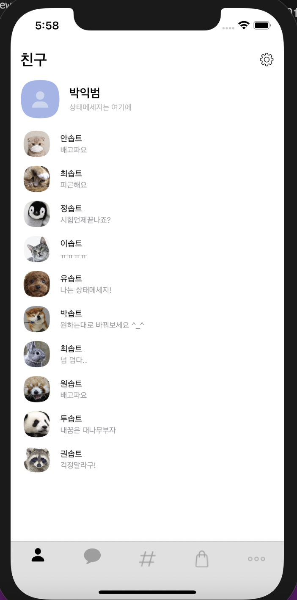

# 3주차 과제

이번주에는 Delegate + Protocol + TableView + CollectionView를배웠당

처음에 들을땐 정말 이해가 1도 되지않고 오류를 뿜뿜하는 xcode를 보며 눈물이 주르륵흘렀지만,,
집에와서 차분한 마음가짐으로 복습하며 다시 해보니 잘됫다. 

# delegate + Protocol + tableView + CollectionView

딜리게이트를 사용하기 위해선 프로토콜을 알아야하는데, 프로토콜은 구현을 위한 청사진의 느낌이었다. 
    
    protocol 이름 {
        내용
    }

이런식으로 구현을 해주고, 어느 뷰컨에다 만들어도 어느 뷰컨에서나 호출이 가능했다. 
우선 딜리게이트를 써야하는 이유는 데이터 전달을 위해서 였는데, 데이터 전달을 해주는 과정속에서 프로토콜에서 데이터 전달을 해주는 함수를 선언 해주고, var delegate라는 데이터를 줄 곳을 선언해준다. 그 후, 전달받을 뷰 컨트롤러에서 프로토콜을 채택하고,  그 이후 데이터를 받을 뷰컨에서 데이터를_줄_뷰컨.delegate = self (내가 뒷처리 하겠다.) 라고 선언을 해주고 메소드를 짜주게 되면, 구현된 함수에서 "ㅇㅋ 데이터 받아서 만든 함수대로 처리할게"하고 처리하는 방식이다. 

처음에 이해가 잘 안됬던 부분은, 그냥 뷰컨끼리 데이터를 전달해주면되지 왜 굳이 복잡하게 꼬아서 보내는가 라고 생각했었는데, 사실 이건 push나 present시에는 맞는 말이었지만, dismiss나 pop시에는 완벽히 틀린생각이었다. 값을 보내는 행위 자체가 push나 present시에 진행되는 것 이었기에, 내가 아무리 받아!! 받으라고!!! 해도 의미가 없던 것이었다. (짝사랑이네,,,)
그래서 이럴경우, 딜리게이트를 통해 값을 전달해주면 정확하게 값을 전달해 줄 수 있다는 것을 깨달았다. 

테이블 뷰의 경우에는 처음에는 테이블 뷰도 다른 UIView들 처럼 '뷰'로써 보는 관점으로 접근해서 이해가 조금 힘들었지만,, 구선생님을 통해 열심히 검색하다보니 한 댓글에서 "데이터를 나열하는 관점으로 봐라" 라는 문구를 보고 깨닳았다. 아 그냥 데이터 이쁘게 보여주는거구나.
그래서 그 이후로는 잘 짤 수 있던것 같다.하하.. 
컬렉션뷰는 테이블 뷰와 거의 흡사한 개념인 것 같아서 테이블뷰를 이해하자 구현할 수 있었던 것 같다. 

아무튼 그래서 처음에는 테이블 뷰를 이용해서 친구목록을 구현하는 거였다. 
테이블 뷰는 dequeueReusableCell 을 이용해서 구현해야 했다. 
데이터를 받아와서 뷰를 짜는 것 이기때문에, 몇개의 데이터가 있을지 정확히 파악이 안되는 상황에선
dequeueReusableCell이 방식을 이용해서 구현을 해야 했따. 
    
    guard let friendsCell = tableView.dequeueReusableCell(withIdentifier: FriendsTableViewCell.identifier, for: indexPath) as? FriendsTableViewCell else {return UITableViewCell() }

CellController에서 셀을 하나하나 받아오고, 갯수는 

    extension FreindsViewController : UITableViewDataSource{
    func tableView(_ tableView: UITableView, numberOfRowsInSection section: Int) -> Int {
        return friendList.count
    }
으로 세주어 받아왔다. 
그럼 각각의 셀에 데이터는 어떻게 넣어주느냐!
라고 물어본다면 답해주는게 인지상정.

    friendsCell.setData(imageName: friendList[indexPath.row].imageName, Name: friendList[indexPath.row].name, message:friendList[indexPath.row].state)
        return friendsCell

friendsCellController에 setData함수를 만들어주고! 이함수가 각각의 변수를 집어넣을 수 있도록 해주는 역할이당.

암튼 그렇게 뚝딱뚝딱 해서 만들면! 

요렿게 구현이 된다.
이제 여기서 각 셀을 눌러서 다른 뷰컨으로 넘어가게 하는 법은!

    func tableView(_ tableView: UITableView,  didSelectRowAt indexPath: IndexPath) {
            tableView.deselectRow(at: indexPath, animated: true)
        guard let profileVC = storyboard?.instantiateViewController(identifier: "FreindsProfileViewController") as? FreindsProfileViewController else{return}
        self.present(profileVC, animated: true, completion: nil)
        profileVC.setData(imageName: friendList[indexPath.row].imageName, Name: friendList[indexPath.row].name, state: friendList[indexPath.row].state)

으로 didselect되면 profileVC를 불러주고, 그안에서 값을 다시 찾아올 수 있도록 해주었당.

두번째는, 컬렉션 뷰를 구현하는건데, 컬렉션 뷰의 레이아웃을 잡는 것 말고는 테이블 뷰의 방법과 똑같아서 그냥 잘 구현했다 ㅋ.ㅋ

도전과제 액션 쉬트는 버튼 클릭시 actionSheet을 띄우는 것 이었는데, 

     let actionSheet = UIAlertController(title: .none, message: .none, preferredStyle: .actionSheet)
           actionSheet.addAction(UIAlertAction(title: "편집", style: .default, handler: {(ACTION:UIAlertAction) in
           }))
추가적인 기능 구현은, addAction으로 해주면 되는것이다. 

두번째 도전과제는, 슬라이스 해서 차단,숨김이 뜨게 만드는 것이엇는데, 
    
    func tableView(_ tableView: UITableView, trailingSwipeActionsConfigurationForRowAt indexPath: IndexPath) -> UISwipeActionsConfiguration? {

이 함수를 이용해서 구현 해 줬다. 
차단을 눌렀을땐 사용자가 누른 리스트값을 remove(indexPath)해주어서 
그 값을 지워버리고! reload()해주어서 테이블뷰를 새로고침 해주었당.

마지막 도전과제는,,, 시간문제때문에 구현하지 못했다. 그래서 이건 조만간 시간이 생기면 해볼예정이다. 

암튼 이제 구현한 내용 시연영상!

